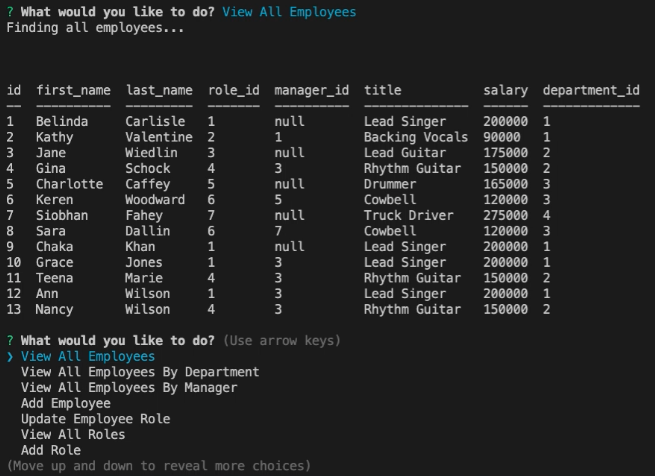

# Employee Tracker 

[](https://www.youtube.com/watch?v=GbEgXy0xhdo&feature=youtu.be)

[Link to walkthrough video on YouTube](https://www.youtube.com/watch?v=GbEgXy0xhdo&feature=youtu.be)

## Description

Welcome to Employee Tracker: An application that allows the user to view and manage the departments, roles, and employees in their company so they can organize and plan their business. The app connects to a MySQL database, and the user can add new information to the database. The user can view employees by certain categories. 

## Installation

To install, run: 

```
npm i
```
The app uses the mysql and inquirer packages.

## Usage

Clone or fork this repo if you would like. You must have node.js installed on your system.

## License

This application is covered under the MIT license.

## Contributing

Submit a pull request if you would like to contribute.

## Questions
Feel free to email me at seandoesitbetter@gmail.com with any questions.

Check out my GitHub profile: [seanc0ne](https://www.github.com/seanc0ne)
